# Google DRIVE api 

## Step1. Create a service account on google 

- Go to google cloud console, and create a project and select that project.
- Then in top left corner click on sidebar icon and navigate to `IAM & Admin`

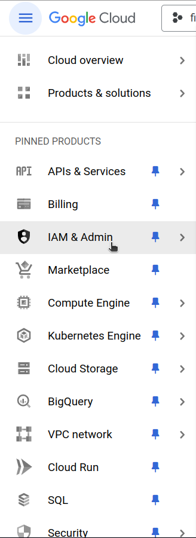

- Again in sidebar look for `Service Account`

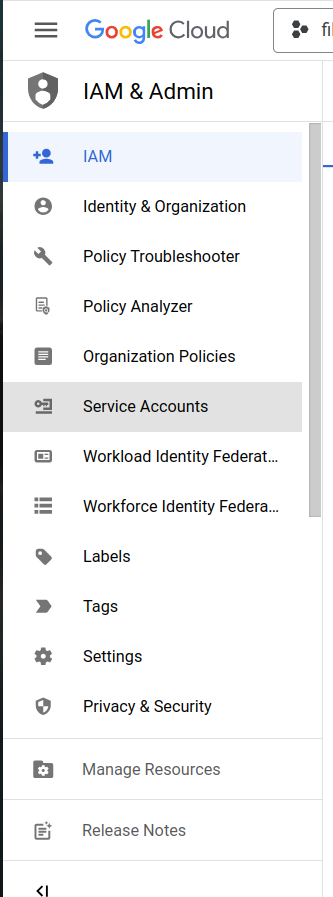

- In top bar click on `Create Serivce Account`

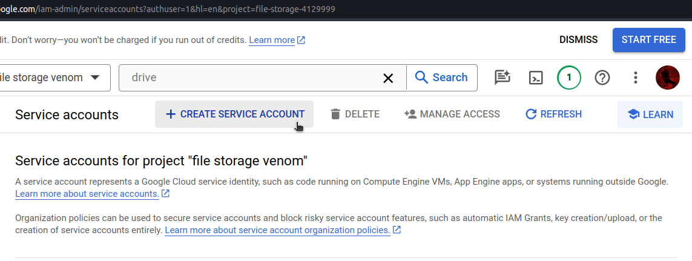

- Fillin the details

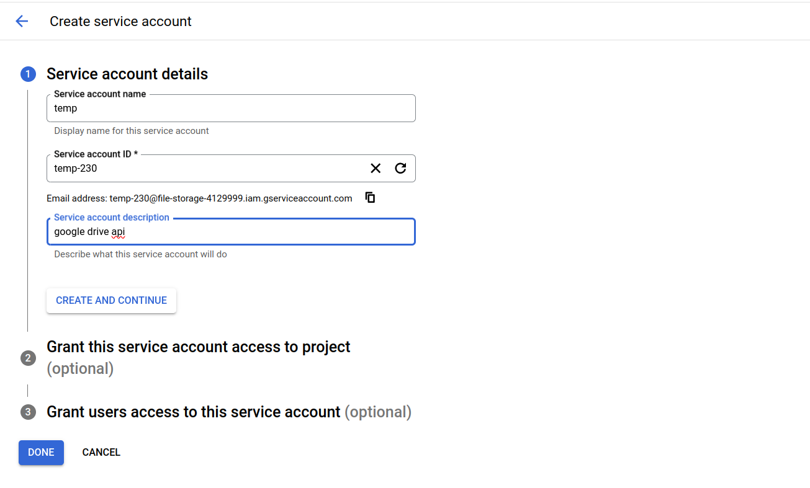

- for step 2 and 3 during creation directly click Done as they are optional
- It should Look like this 


- Click on three dots in above image, and go to manage keys

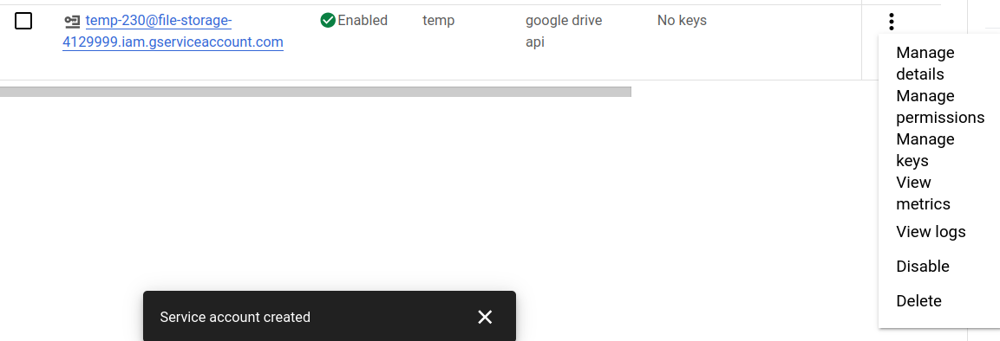

- Click on add key drop down and click on create key

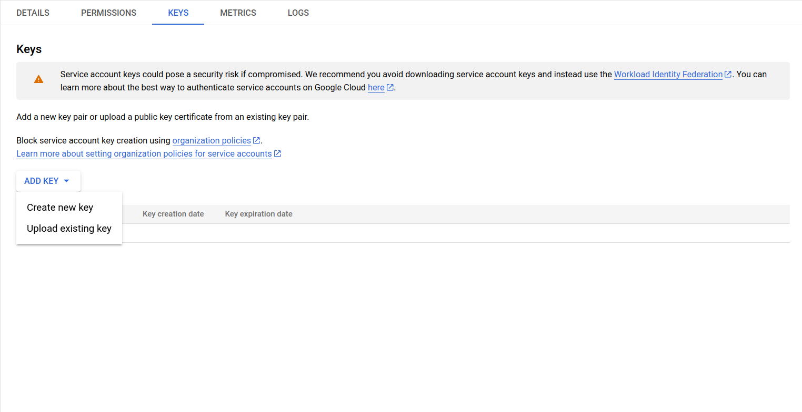

- Select json and save the key in a secure location as you will not be able to download it again

Now account has been created with the key !!

## Step2. Install required libraries

```bash
pip install google-api-python-client
```

## Step3. Get parent folder id from google drive 

- Go to drive.google.com, and create a folder

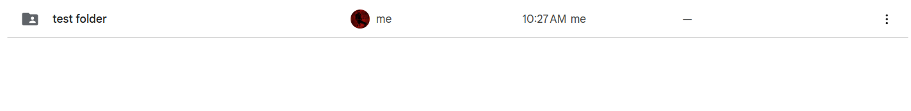

- Go to google cloud consle and inside service account and copy the email.

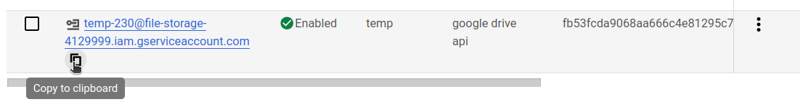

- Share the folder with that email and give editior access

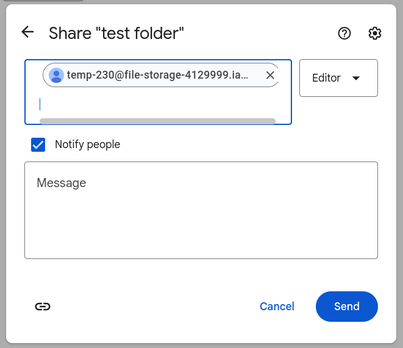


## Step4. Run the code app.py 

- To run the app, you must first copy the folder id of the shared folder

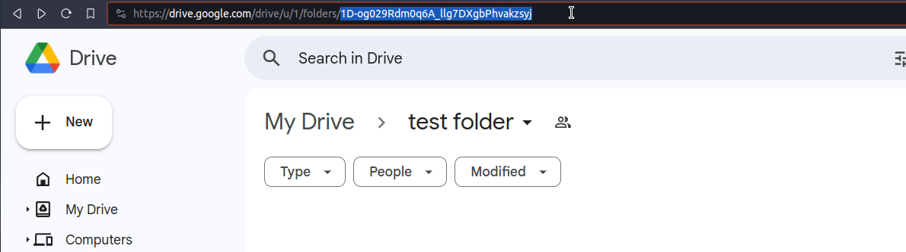

- Paste it in variable PARENT_FOLDER_ID

- Run the code

```bash
python3 app.py
```
- Output must be like this

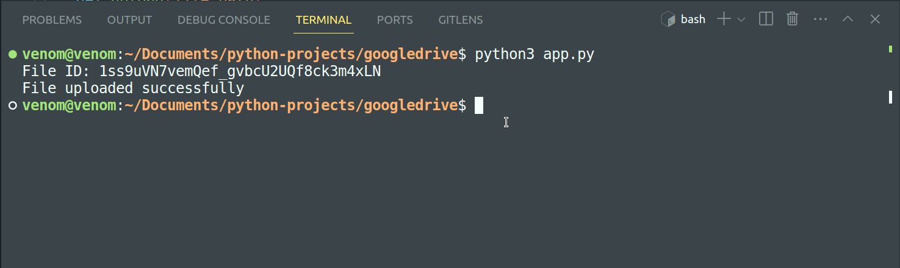


#### Note: The key you downloaded must be in same folder as your app.py and the key should be renamed to `service_account.json`

Enjoi !